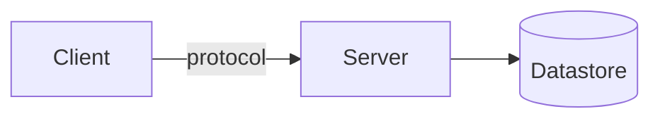

<div class="cover">
<div class="kicker">Course · COURSE_NAME</div>
<h1>Phase N<br/>PHASE_TITLE</h1>
<div class="sub">One-line subtitle of what this phase delivers</div>
<div class="meta">
Project: WHAT_IS_BEING_BUILT<br/>
Audience: WHO_THIS_IS_FOR<br/>
Document N / TOTAL · MVP → Production<br/>
Stack: SUMMARY
</div>
</div>

# Objectives

What the learner will understand and be able to do by the end of this phase.
End-state milestone (the concrete "it works" check).

<div class="callout note" markdown="1">
<span class="lbl">ℹ Context</span>
One-paragraph reminder of the project and constraints, so this document stands alone.
</div>

# Theory you need

Explain the concepts required before coding, for a newcomer, with analogies.

<div class="callout key" markdown="1">
<span class="lbl">◆ Core concept — TERM</span>
Definition the learner should remember.
</div>



# Architecture & decisions

System/data diagram, then an ADR per significant choice.

### ADR-XXXX — TITLE

**Context.** …

**Decision.** …

**Alternatives & comparison.**

| Option | Pros | Cons | Why not chosen |
|--------|------|------|----------------|
| **CHOSEN** ✅ | … | … | — |
| ALT | … | … | … |

**Consequences.** …

<div class="callout note" markdown="1">
<span class="lbl">ℹ Fact vs recommendation</span>
Fact: … . Recommendation: … (opinion, not absolute).
</div>

# Hands-on

Step-by-step, runnable. Prefer a fast local dev loop first.

```bash
# commands the learner runs
```

```LANG
// code, explained part by part below
```

<div class="callout warn" markdown="1">
<span class="lbl">▲ Caution — COMMON PITFALL</span>
The mistake newcomers make here, and how to avoid it.
</div>

# Test & Deploy

How to verify the feature actually works; commands and expected output.

# SPEC Phase N — specification & acceptance

## Scope
| In scope | Out of scope (later phases) |
|----------|------------------------------|
| … | … |

## Functional requirements
- **FR-N.1** — …

## Non-functional requirements
- **NFR-N.1** — …

## Acceptance checklist
- [ ] …
- [ ] One deliberate failure test (break it, confirm it reports the failure).

# Summary & next phase

What was achieved. What Phase N+1 will build (short preview + diagram).

<div class="callout key" markdown="1">
<span class="lbl">◆ Handoff</span>
When this works, tell me "done with Phase N" and I'll write Phase N+1. One phase at
a time, on purpose.
</div>
