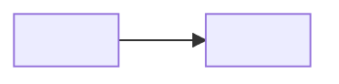

<!--
PHASE TEMPLATE — copy, fill, render to PDF.

Sections marked [DEEP] are required only at the Deep depth level (Core rule 6);
delete them at Standard level. See references/authoring-conventions.md.

Write in the course's chosen language. Replace every placeholder. Delete these
comments and any section note that doesn't apply.

DOMAIN NOTE: the diagrams and terms below are placeholders. Use this course's actual
domain vocabulary — see references/domain-playbooks.md. Do not leave client/server
shapes in a game or web course.
-->

<div class="cover">
<div class="kicker">Course · COURSE_NAME</div>
<h1>Phase N<br/>PHASE_TITLE</h1>
<div class="sub">One-line subtitle of what this phase delivers</div>
<div class="meta">
Project: WHAT_IS_BEING_BUILT<br/>
Audience: WHO_THIS_IS_FOR<br/>
Document N / TOTAL<br/>
Stack: SUMMARY
</div>
</div>

# Objectives

What the learner will understand and be able to do by the end of this phase.
End-state milestone (the concrete, observable "it works" check).

<div class="callout note" markdown="1">
<span class="lbl">ℹ Context</span>
One-paragraph reminder of the project and constraints, so this document stands alone.
</div>

<!-- ===================== [DEEP] ===================== -->

# Terminology for this phase

<!-- Every new term, BEFORE it is used anywhere below. The rule: the learner never
     meets an undefined term. -->

| Term (EN) | In LANG | What it literally means | Analogy | Where it shows up here |
|-----------|---------|------------------------|---------|------------------------|
| … | … | … | … | … |

<!-- ================================================== -->

# Theory you need

Explain the concepts required before coding, for a newcomer, with analogies.

<div class="callout key" markdown="1">
<span class="lbl">◆ Core concept — TERM</span>
The definition the learner should still remember in six months.
</div>



<!-- ===================== [DEEP] ===================== -->

# Problem & solutions

<!-- One block like this per technical decision in the phase. This teaches the learner
     HOW TO REASON; the ADR below records WHAT THE PROJECT CHOSE. -->

## Problem: <the question the learner would ask>

<Why this is genuinely hard / non-obvious.>

**Possible solutions.**

1. **<Naive approach>** — <how it would work>
2. **<Alternative>** — <how it would work>
3. **<The one we'll use>** — <how it would work>

| Approach | Pros | Cons | Complexity | Performance |
|----------|------|------|-----------|-------------|
| … | … | … | … | … |

**We'll use <X>.** <Why — with fact vs recommendation made visible.>

<!-- ================================================== -->

# Architecture & decisions

System/data diagram, then an ADR per significant choice.

### ADR-XXXX — TITLE

**Context.** …

**Decision.** …

**Alternatives & comparison.**

| Option | Pros | Cons | Why not chosen |
|--------|------|------|----------------|
| **CHOSEN** ✅ | … | … | — (this is the choice) |
| ALT | … | … | … |

**Consequences.** What this buys, what it costs, what it commits future phases to.

<div class="callout note" markdown="1">
<span class="lbl">ℹ Fact vs recommendation</span>
Fact: … . Recommendation: … (my opinion, not absolute).
</div>

# Hands-on

Step-by-step, runnable. Prefer a fast dev loop first, production shape later.
**Every step says *why*, not just what to press.**

## Step 1 — <name>

<Why this step exists.>

```bash
# commands the learner runs
```

```LANG
// Dense inline comments: what this does AND why.
```

<!-- [DEEP] — dissection below every code block -->

**Dissecting it:**

- `<line or construct>` — <syntax the learner may not know; the intent>.
- `<line or construct>` — <the pitfall here>.
- <Why written this way rather than <the obvious alternative>.>

<div class="callout warn" markdown="1">
<span class="lbl">▲ Caution — COMMON PITFALL</span>
The mistake newcomers make here, and how to avoid it.
</div>

<!-- ===================== [DEEP] ===================== -->

# Common mistakes

<!-- Symptom-first: that's how the learner will search. -->

### <Mistake 1>

**Symptom:** <the exact error text or observed behaviour>
**Cause:** <why it happens>
**Fix:** <what to do>

<!-- ================================================== -->

# Test & Deploy

How to verify the feature actually works; the exact steps and expected output.

## Deliberate failure test

<Break something on purpose; state what the learner should observe. This is required.>

# SPEC Phase N — specification & acceptance

## Scope
| In scope | Out of scope (later phases) |
|----------|------------------------------|
| … | … |

## Functional requirements
- **FR-N.1** — …

## Non-functional requirements
<!-- Use the axes that matter in THIS domain: frame time / bundle size / p99 latency
     / correctness / reproducibility. Don't default to throughput. -->
- **NFR-N.1 (<axis>)** — …

## Acceptance checklist
- [ ] …
- [ ] One deliberate failure test (break it, confirm it reports the failure).

# Summary & next phase

What was achieved. What Phase N+1 will build (short preview + diagram).

<div class="callout key" markdown="1">
<span class="lbl">◆ Handoff</span>
When this works, tell me "done with Phase N" and I'll write Phase N+1. One phase at
a time, on purpose.
</div>
