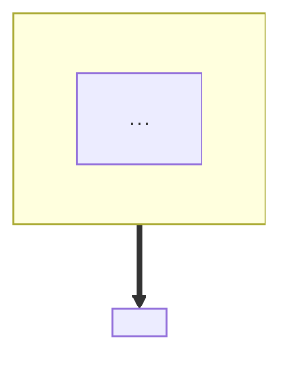
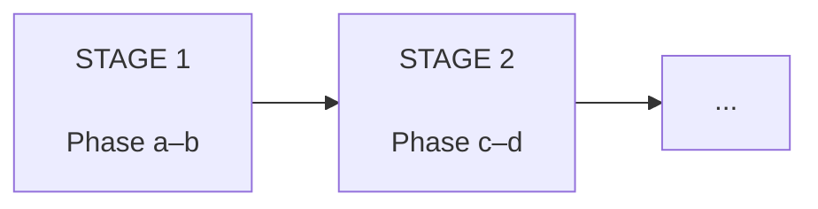
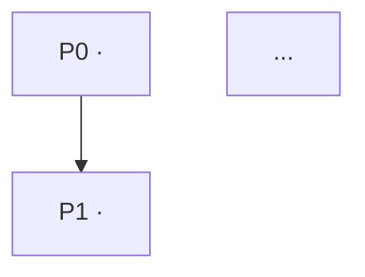

<!--
ROADMAP TEMPLATE — copy this file, fill it in, render to PDF, deliver for approval
BEFORE writing Phase 0.

Read references/roadmap-doc.md first: it explains how to derive the stages, build the
dependency graph, calibrate ★ difficulty, and estimate time honestly.

Write in the course's chosen language (Core rule 5). Delete these comments.
-->

Course · <COURSE NAME>

<h1>Roadmap The Full <N>-Phase Plan</h1>

The whole journey: what you'll build, in what order, and why

Audience: <who> · Project: <one line> · Roadmap document · Stack: <key tech>

# Roadmap — The map of the whole course

<!-- Open by saying what this document is FOR. The learner is about to commit dozens
     of hours; earn that commitment by showing them the shape of the journey. -->

Before writing any code, you need a **map**. This document is that map.

It answers the four questions anyone starting a large project needs answered up front:

1. **What am I building?** — the whole system, its pieces, and how they fit.
2. **In what order, and why that order?** — the learning arc and the dependency graph.
3. **What does each phase teach me?** — objectives, concepts, terminology,
   deliverable, difficulty, time.
4. **Where am I on the journey?** — a progress tracker.

◆ How to use this document
Read it <b>once end to end now</b> for the big picture — don't worry if some terms
are unfamiliar, that's expected and intentional. Then <b>re-read the section for each
phase</b> as you start it. This is a document you keep coming back to.

ℹ Not understanding the jargon yet is fine
<!-- List 3-4 of the scariest terms from this specific course here. -->
You'll see terms like <i><term A></i>, <i><term B></i>, <i><term C></i> below.
<b>You don't need to understand them yet.</b> Every phase opens with a glossary that
defines each new term before using it. This roadmap only shows you the <i>shape</i> of
the journey, it doesn't teach the content.

---

## Part 1 — What am I building?

### 1.1 What is this system?

<!-- Plain language. No jargon. What does it DO, from a user's point of view? -->

<2–3 paragraphs.>

<!-- Then: the hard questions. This is what makes the learner curious and shows the
     course is worth their time. Frame each as a real engineering problem. -->

It sounds simple. But to do that, the system has to answer some genuinely hard
questions:

- How do you <hard problem 1>?
- How do you <hard problem 2>?
- How do you <hard problem 3>?

This course teaches you to answer each one — by building it yourself.

### 1.2 The whole-system picture

<!-- ONE diagram. The single most important structural insight about this system.
     Group by the natural split of THIS system, not a generic tier diagram. -->

◆ Core concept — <the big organising idea>
<!-- Every system has ONE central idea that unlocks the rest (e.g. "bake offline,
     load at runtime"; "the server is authoritative"; "everything is a stream").
     Name it, explain it, and give an everyday analogy. -->
<b>Analogy:</b> <everyday comparison>.

### 1.3 The subsystems you'll build

| Subsystem | What it does | Phase |
|-----------|--------------|-------|
| … | … | … |

---

## Part 2 — In what order, and why?

### 2.1 The learning arc — <N> stages

<!-- Group the phases into 3–5 named stages. Give each a "personality" so the learner
     knows what the experience will feel like, including the boring parts. -->

**Stage 1 — <name> (Phase a–b).** *Personality: <e.g. slow, theory-heavy>.* <what
happens and why it matters>.

<!-- Repeat per stage. Be honest about which stage is a slog and which is the payoff.
     Naming the slog in advance is what stops people quitting in it. -->

✔ Advice — <about the hardest/most demotivating stage>
<!-- Pre-empt the moment they'll want to quit. -->

### 2.2 Why this order? — the dependency graph

<!-- Arrows mean "B needs A done first". Derive from REAL dependencies, not vibes. -->

Read it as: `A --> B` means **"B needs A finished first"**.

Things worth noticing:

- **Phase X is the root.** <why so much grows from it>
- **Phase Y is a bottleneck.** <which phases converge here and why>
- **Phase Z is last** because <reason>.

▲ Don't skip ahead
<!-- Name the specific phase they'll be tempted to jump to, and why it won't work. -->

### 2.3 All <N> phases at a glance

| # | Phase | Stage | Difficulty | Time estimate |
|---|-------|-------|-----------|---------------|
| 0 | … | 1 | ★☆☆☆☆ | … |

**Total estimate: roughly <X>–<Y> hours.**

ℹ These hours are an <i>estimate</i>, not a fact
<b>Fact:</b> the amount of content per phase is fixed. <b>My estimate:</b> the hour
figures assume <state the assumptions: level, studying properly, not copy-pasting>.
Someone who already knows <X> may go 2–3× faster. <b>Don't use this table to judge
yourself</b> — use it to plan roughly.

◆ What the difficulty stars mean
<b>★☆☆☆☆</b> — follow the steps and it works. 
<b>★★☆☆☆</b> — new concepts, but familiar programming. 
<b>★★★☆☆</b> — needs real <domain> thinking; you'll get stuck sometimes. 
<b>★★★★☆</b> — advanced concepts; expect to re-read. 
<b>★★★★★</b> — <b>the summit</b>: <what makes it hard>. Take your time here; this is
where you learn the most.

---

# Part 3 — Phase by phase

<!-- EVERY entry uses the same shape. Consistency is what makes it scannable. -->

Each entry below has the same structure:

- **Central question** — the problem this phase solves.
- **Objectives** — what you'll understand and be able to do.
- **New concepts** — the big ideas introduced.
- **Terminology** — the new jargon (each phase has a full glossary).
- **Deliverable** — what runs at the end, including a visible **milestone**.
- **Dependencies** — what must be done first.
- **Reference source** — <only if rebuilding an existing system>.

---

## Stage 1 — <name>

### Phase 0 — <title> ★☆☆☆☆

**Central question:** *<the question>*

**Objectives.** <what they'll be able to do>

**New concepts.**

<!-- NOTE: keep a blank line before the list — python-markdown needs it. -->

- …

**Terminology.** term1, term2, term3, …

**Deliverable.** <what exists at the end>. **Milestone: <the concrete thing they can
see working>.**

**Dependencies.** None (first phase).

**Reference source.** `<path/to/file>`

<!-- Repeat for every phase, grouped under its stage heading. -->

---

# Part 4 — How to study this course

## 4.1 Working a phase

✔ Suggested process per phase (my recommendation)
<b>1. Skim the whole phase</b> first (~15 min). 
<b>2. Read the glossary</b> — don't skip it. 
<b>3. Read the theory slowly</b>, stopping at each ◆ callout. 
<b>4. Do the hands-on</b>, <b>typing the code yourself</b>. 
<b>5. Do the "break it" exercise.</b> 
<b>6. Tick the SPEC checklist</b> honestly. 
<b>7. Commit</b> with a clear message. 
<b>8. Rest</b>, then re-read the summary the next day.

◆ Why type the code instead of copy-pasting
When you type, your brain processes every token. When you paste, your eyes slide past
and nothing sticks. Learning research calls this <b>desirable difficulty</b> — the
effort is what makes the memory durable. Five minutes slower to type; months longer
to remember.

## 4.2 When you're stuck

Being stuck is **part of learning**, not evidence you're bad at this. Try in order:

1. **Read the error message properly.**
2. **Log everything** — print the values and see how reality differs from your model.
3. **Check the "common mistakes" section** of that phase.
4. **Compare against the reference source** — but only after trying yourself.
5. **Ask**, describing: goal, what you tried, what happened.

▲ The biggest trap — copying the reference when stuck
Reading a solution feels like understanding, but it doesn't create the ability to do
it yourself. Struggle first; then the reading teaches you something.

## 4.3 Progress tracker

| # | Phase | Done on | Notes / still unclear |
|---|-------|---------|----------------------|
| 0 | … | | |

## 4.4 Before you start

<!-- Close with something honest and motivating. Acknowledge the difficulty. -->

<2–3 short paragraphs.>

Now open [Phase 0](phase0.md) and let's begin. 🚀
