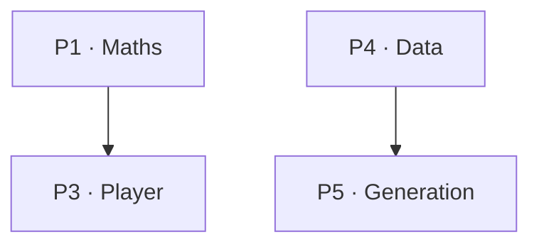

# Writing the Roadmap document

Read this before writing a Roadmap. The template (`assets/roadmap-template.md`) gives
you the shape; this file gives you the judgement — how to derive the stages, build an
honest dependency graph, calibrate difficulty, and estimate time without lying.

The Roadmap is delivered **before Phase 0** and must be **approved** before any phase
is written. Its whole purpose is to make wrong assumptions cheap to fix.

---

## The four questions (and why they're in this order)

| # | Question | What it gives the learner |
|---|----------|---------------------------|
| 1 | What am I building? | Motivation and a mental model to hang everything on |
| 2 | In what order, why? | Trust that the sequence isn't arbitrary |
| 3 | What does each phase teach? | The ability to plan, and to look ahead when curious |
| 4 | Where am I? | A sense of progress across a months-long effort |

Answer them in this order. Question 1 earns the attention that makes 2–4 worth
reading. Do not open with a phase table — that's answering question 3 to someone who
doesn't yet know what they're building.

---

## Question 1 — What am I building?

### Start with what it *does*, not how it works

Two or three paragraphs, plain language, zero jargon. A person who has never heard of
this system should finish the paragraph knowing what it is.

### Then pose the hard problems

This is the hook. List 3–4 genuinely hard engineering questions the system must
answer. Not "how do I make a button" — the real ones:

> - How do you render an entire planet from real data and still hit 60 fps?
> - How do you know which country a point landed in, when borders are tens of
>   thousands of polygons?

This does two jobs: it makes the learner curious, and it proves the course is worth
their time. **Derive these from the actual system**, not from a generic list.

### The whole-system diagram

**One** diagram. Resist the urge to draw everything — pick the single most important
structural insight and show that. Group by the natural split of *this* system:

| System type | The split that usually matters |
|-------------|-------------------------------|
| Game with baked assets | Offline generation ↔ runtime |
| Client/server game | Client ↔ authoritative server |
| Web app | UI ↔ state ↔ data fetching |
| Backend | Ingress ↔ services ↔ datastores |
| Compiler | Front end ↔ IR ↔ back end |
| ML pipeline | Training ↔ serving |

### Name the big organising idea

Every system has **one central idea** that unlocks the rest. Find it and put it in a
`key` callout with an everyday analogy. Examples:

- Game with heavy assets → *"bake offline, load at runtime"* (a bakery bakes at 4am;
  the customer just picks it up).
- Multiplayer → *"the server is the single source of truth"* (a referee, not a
  democracy).
- React app → *"UI is a function of state"* (a spreadsheet formula, not a to-do list
  of DOM edits).
- Compiler → *"lower through IRs, one small step at a time"*.

If you can't name the idea, you don't understand the system well enough to write the
course yet. Go read more of the source.

---

## Question 2 — In what order, and why?

### Deriving the learning arc (stages)

Group the phases into **3–5 stages**. Fewer than 3 and it isn't a structure; more
than 5 and it's just the phase list again.

Give each stage a **personality** — an honest description of what it *feels* like:

> **Stage 1 — Foundations (Phase 0–2).** *Personality: slow, theory-heavy, nothing
> flashy.* … This is the stage where people quit — and the stage that decides whether
> the next 12 phases are easy or awful.

**Naming the slog in advance is what stops people quitting in it.** A learner who was
told "Phase 0–2 will feel like nothing is happening" reads their boredom as *on
track*. A learner who wasn't reads it as *failing*.

Also name the payoff stage ("this is the fun one") and the summit ("hardest and most
valuable").

### The dependency graph

This is the load-bearing part of question 2. **Derive it from real dependencies**, not
from the order you happened to list things.

For each phase ask: *what must exist for this phase's hands-on to run at all?* That,
and only that, is an arrow.



Then **read your own graph** and tell the learner what it says:

- **Roots** — phases many others depend on. Say so: *"Phase 1 is the root; three
  branches grow from it. This is why it comes early."*
- **Bottlenecks** — phases where several lines converge: *"Phase 9 needs three phases
  to land first."*
- **Leaves** — phases that could move: *"Localisation could be done any time after
  Phase 3; it's scheduled late because it's not on the critical path."*

If the graph shows an ordering different from your phase numbers, **fix the phase
numbers**. The graph is the truth; the numbering serves it.

### Warn against skipping

Name the specific phase learners will want to jump to (the exciting one — usually the
★★★★★ graphics/algorithm phase) and show, from the graph, why it won't work yet.

---

## Question 3 — What does each phase teach?

Every entry uses the **same shape**. Consistency makes it scannable and forces you to
notice when a phase is under-specified.

```markdown
### Phase N — <title> ★★★☆☆

**Central question:** *<the one problem this phase solves>*

**Objectives.** <what they'll understand and be able to do>

**New concepts.**

- <big idea 1>

**Terminology.** <comma-separated list of new jargon>

**Deliverable.** <what exists>. **Milestone: <the visible proof it works>.**

**Dependencies.** Phase X (<what for>), Phase Y (<what for>).

**Reference source.** `<path>` — only when rebuilding an existing system.
```

Notes on the harder fields:

**Central question.** One question, phrased as the learner would ask it. If you can't
write it in one sentence, the phase is doing too much — split it.

**Terminology.** List the terms now; the phase itself will define them. This lets the
learner see the vocabulary they're about to acquire, and it's a checklist for you when
writing the phase's glossary. A phase with 20+ new terms is probably two phases.

**Milestone.** Must be **observable**. Not "the lookup system works" but *"drop a
package and the console prints: landed in Vietnam, 12m above sea level"*. Milestones
are what make a long course feel like progress. Every phase needs one.

**Reference source.** When the course rebuilds an existing system, cite the real files
per phase. Read them before writing — never guess at what the reference does.

---

## Question 4 — Where am I?

Three things:

1. **A progress table** the learner fills in (phase, done-on, notes).
2. **A study process** — the 8-step loop in the template. Include *why* typing beats
   pasting (desirable difficulty).
3. **What to do when stuck** — an ordered list, ending with "ask". Include the warning
   about copying the reference too early.

Close with something honest. Acknowledge that the thing is hard, that they will get
stuck, and that this is the job. Do not close with hype.

---

## Difficulty calibration (★)

Be consistent across the course. A useful default:

| Stars | Meaning | Typical marker |
|-------|---------|----------------|
| ★☆☆☆☆ | Follow steps, it works | Setup, config, packaging |
| ★★☆☆☆ | New concepts, familiar programming | CRUD, state machines, I/O |
| ★★★☆☆ | Needs real domain thinking; will get stuck | 3D maths, async, architecture |
| ★★★★☆ | Advanced; expect re-reading | GPU, spatial algorithms, concurrency |
| ★★★★★ | The summit | Parallel programming, computational geometry, compilers |

Rate honestly. Inflating everything to ★★★★★ destroys the signal; flattening
everything to ★★☆☆☆ makes the summit ambush them.

---

## Time estimates — how to not lie

> Learners measure themselves against these numbers. An unlabelled guess becomes a
> source of shame when they run 3× over.

Rules:

1. **Give a range**, never a point ("6–10 hours", not "8 hours").
2. **Label it an estimate**, in the document, explicitly — separate the fact (content
   volume is fixed) from the inference (how long *you* will take).
3. **State the assumptions**: their level, studying properly rather than pasting.
4. **Say the deviation is normal**: experienced people 2–3× faster, and that's fine.
5. **Tell them not to self-judge** with the table.

Rough anchors (my estimates, not facts): a ★☆☆☆☆ phase 2–4h; ★★☆☆☆ 4–6h; ★★★☆☆ 6–10h;
★★★★☆ 6–10h; ★★★★★ 10–15h. Adjust for the actual content.

---

## Mechanics

- **Filename:** `docs/phases/roadmap.md` → `roadmap.pdf`.
- **Footer:** `"<Course name> · Roadmap"`.
- **Length:** typically 800–1200 source lines (~20 pages). It's a map, not a phase —
  don't teach content in it.
- **Language:** the course language (Core rule 5).
- **Build and inspect** like any phase (`references/pdf-pipeline.md`), then deliver
  and **wait for approval**.

### Markdown gotcha

A bold label immediately followed by a list renders inline and looks broken:

```markdown
**New concepts.**
- Thing one          ← WRONG: renders as "New concepts. - Thing one"

**New concepts.**

- Thing one          ← RIGHT: blank line first
```

This bites repeatedly in Roadmaps because every phase entry has bold labels followed
by lists. Check a rendered page before delivering.

---

## When the learner changes the plan

If they adjust the phase list after reading the Roadmap:

1. Update the **Roadmap document** (phases, stages, dependency graph, totals).
2. Update the **manifest** roadmap table.
3. Rebuild the PDF.
4. *Then* proceed to Phase 0.

Never let the manifest and the Roadmap document disagree — a later session will read
one of them and quietly build on a stale plan.
