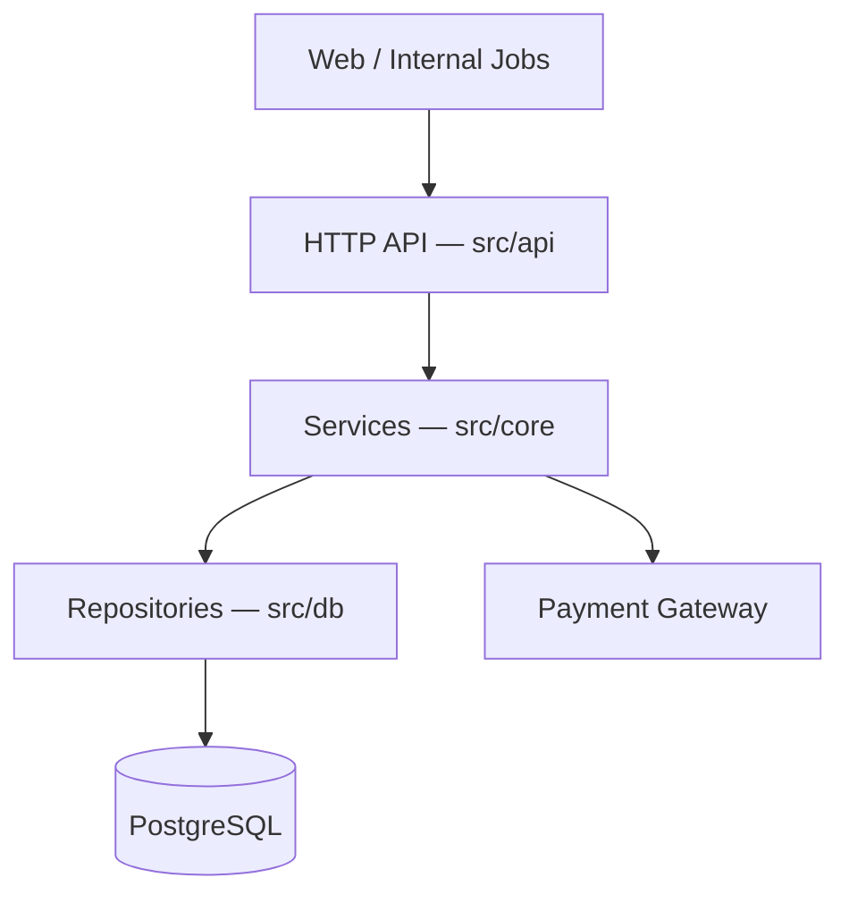
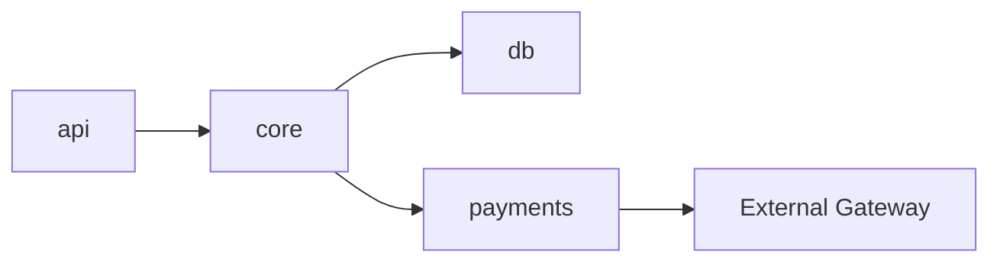
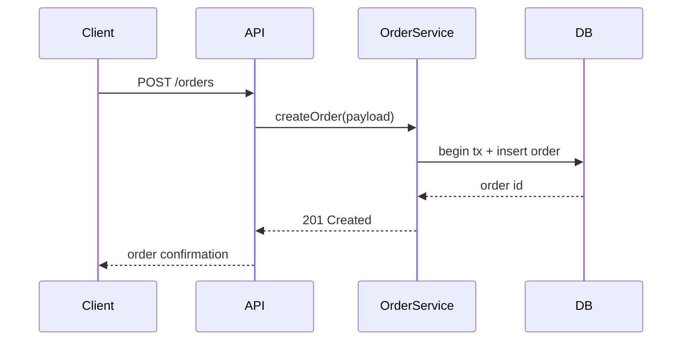

# Architecture Overview

> This project is a REST API for order management built on Express and
> PostgreSQL. Requests flow through an HTTP layer into stateless services that
> use repository classes for persistence. This page describes the top-level
> structure and how the major components interact.

## System context

The service exposes an HTTP API consumed by the web client and internal jobs.
It persists to PostgreSQL and calls an external payment gateway.

## Major components

- **API layer** (`src/api/`) — route definitions and request validation. Entry
  point is `src/server.ts`, which wires middleware and mounts routers.
- **Service layer** (`src/core/`) — business logic, transaction boundaries, and
  orchestration. Stateless; depends on repositories, not on HTTP.
- **Data access** (`src/db/`) — repository classes and query builders over
  PostgreSQL; schema in `src/db/migrations/`.
- **Payments** (`src/core/payments/`) — wraps the external gateway with retries
  and idempotency keys (`src/core/payments/gateway.ts`).

## Module dependencies

## Key request flow — create order

<!-- wiki:protected -->
## Team notes

Order creation must run before the nightly reconciliation job; see runbook.
Keep this note — it is not derivable from the code.
<!-- /wiki:protected -->

## Sources
- `src/server.ts` — app bootstrap and router mounting
- `src/api/` — route and validation layer
- `src/core/orders/orderService.ts` — order creation logic
- `src/db/` — repositories and migrations
- `src/core/payments/gateway.ts` — payment gateway integration
