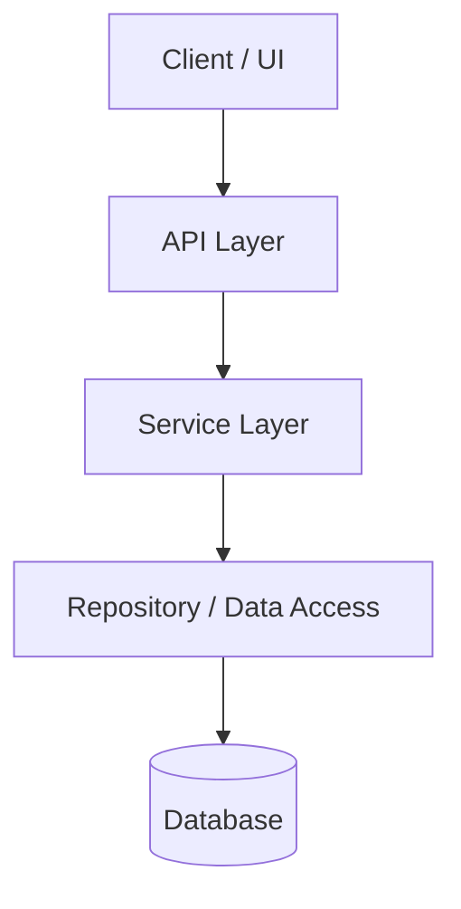
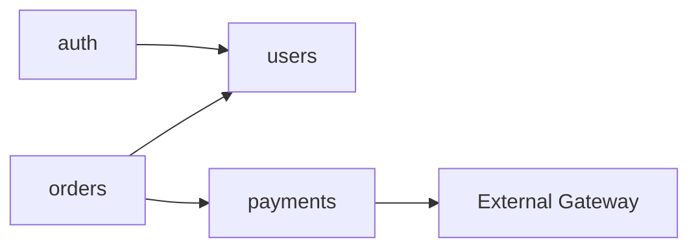
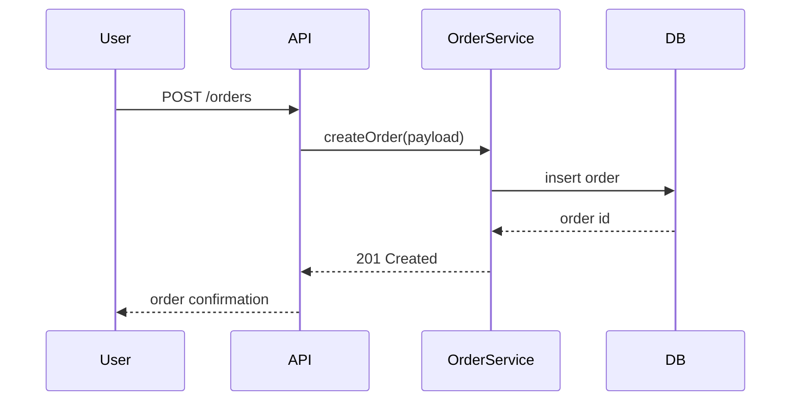
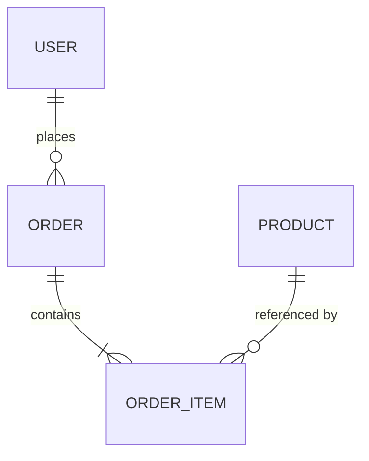
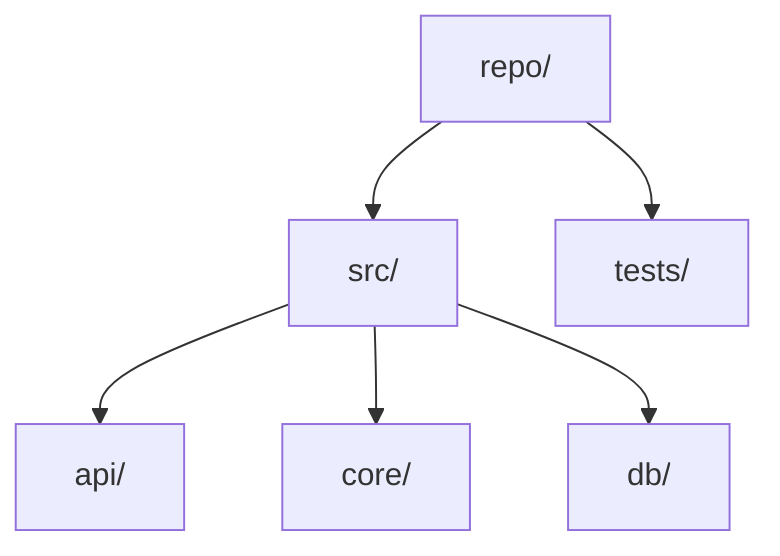

# Mermaid diagram conventions

Diagrams make structure legible. Embed them in pages as fenced ```mermaid blocks.
Keep them small and truthful — a diagram must reflect what the code actually does.
Prefer several focused diagrams over one sprawling one.

## Rules

- Use stable, code-derived node IDs (module or file names). Keep IDs identical
  across language trees so diagrams stay comparable between languages.
- Label edges with the nature of the relationship where it isn't obvious
  (`calls`, `depends on`, `publishes`, `reads`).
- Don't diagram trivial or speculative relationships. If unsure, omit.
- Validate syntax mentally; a broken diagram is worse than none.

## Architecture / component graph

Use on the Architecture Overview page.



## Module dependency graph

Use on the Dependencies page. Direction = "depends on".



## Sequence diagram (key flow)

Use for request lifecycles, auth, or the core domain workflow.



## Entity-relationship diagram (data model)

Use on Data & Persistence / Domain Model pages when a schema exists.



## Directory structure (onboarding)

A flowchart works for a project-layout tour:



Choose the diagram type that matches the relationship: `graph` for structure and
dependencies, `sequenceDiagram` for flows over time, `erDiagram` for data models.
