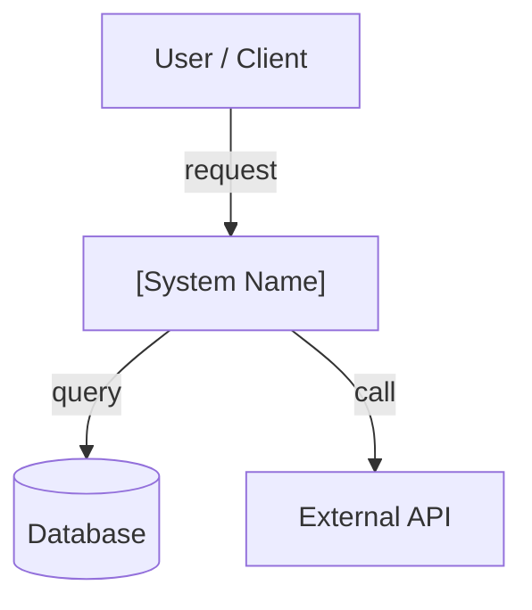
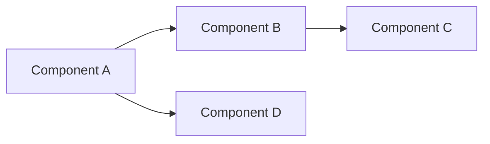

# /system-architecture-doc

Generate a complete, filled-in System Architecture Document (SAD) from a system description or brief, covering all 8 sections including Mermaid diagrams, component breakdown, data models, and risk assessment.

## Usage

```
/system-architecture-doc
```

Slash command only — does not trigger conversationally. Provide the system name, a brief description, and any known constraints or existing diagrams inline or as an attachment. The skill will ask for output format, then generate immediately.

## Workflow at a Glance

```
1. Read     →  extract system context from the conversation and any attachments
2. Elicit   →  collect missing metadata and ask for output format (Markdown or Word)
3. Generate →  write the full 8-section SAD with Mermaid diagrams and domain-aware hints
4. Deliver  →  save to /mnt/user-data/outputs/ and present the file
```

---

## Phase 1 — Read Context

Before asking anything, extract from the conversation and any attached files:

- **System name**
- **Author** (infer from conversation if possible)
- **Purpose and objectives** — what the system does and who uses it
- **Scope** — what is included and explicitly out of scope
- **Tech stack or domain** — web, backend, game, mobile, desktop (or mixed)
- **External entities** — APIs, databases, third-party services, user interfaces the system interacts with
- **Known constraints** — business, technical, regulatory

---

## Phase 2 — Elicit Missing Information

Ask only for what you could not determine from context. Always ask for output format.

**Collect if missing:**
- System name
- Author name(s)
- Primary domain (web/backend, game, mobile/desktop, mixed)

**Always ask:**
- Output format: Markdown (.md) or Word (.docx)?

Keep the form short — one question per genuinely unknown field. Do not ask for things already inferable from context.

---

## Phase 3 — Generate the SAD

Generate the full document immediately after elicitation. Fill each section with real content from context; use `TODO: [description]` for genuinely unknown fields — never invent placeholder facts.

### Document header

```markdown
# System Architecture Document (SAD)

| Field | Value |
|---|---|
| **System** | [name] |
| **Author(s)** | [name] |
| **Version** | 0.1 |
| **Last Updated** | [YYYY-MM-DD] |
| **Related Docs** | [links: SDD, RFC, tickets] |
```

---

### Section 1 — Overview

#### Purpose
2–4 sentences describing the system, its objectives, and its intended users.

#### Scope
What is included in this system and what is explicitly out of scope.

#### Context
The environment in which the system operates, including key business and technical constraints.

---

### Section 2 — Architectural Goals

List the key design principles and trade-offs driving this architecture. Cover the dimensions relevant to this system; use `N/A` for those that don't apply:

- **Performance** — latency/throughput targets
- **Scalability** — expected growth and how the architecture accommodates it
- **Maintainability** — modularity, testability, ease of change
- **Security** — trust boundaries, data sensitivity
- **Simplicity** — avoiding over-engineering given current scale

---

### Section 3 — System Context Diagram

Generate a real Mermaid diagram showing how the system interacts with external entities. Do not leave this as a placeholder — produce an actual diagram block based on the system context gathered in Phase 1.



Adapt entities and labels to the actual system. Add or remove nodes as needed.

#### Description
Explain the key components and their roles shown in the context diagram. One paragraph per major external entity.

Domain hints for external entities:
- For web/backend: browser clients, CDN, auth providers, message queues, third-party APIs
- For game: game client, matchmaking server, analytics backend, platform SDKs (Steam, PSN, etc.)
- For mobile/desktop: mobile app, push notification service, backend API, local storage

---

### Section 4 — Component Diagrams

#### High-Level Architecture

Generate a Mermaid diagram of the internal components and their relationships. Do not leave as a placeholder.



Adapt to the actual architecture. Use subgraphs for logical groupings if helpful.

#### Subsystems & Modules

For each major subsystem or module: name, responsibility, key inputs/outputs, and owner (if known).

Domain hints:
- For web/backend: API gateway, auth service, business logic layer, worker/queue, cache, data access layer
- For game: game loop, scene manager, entity-component system, network layer, save system, audio/rendering pipeline
- For mobile/desktop: UI layer, view model / presenter, local data layer, sync manager, platform adapter

---

### Section 5 — Data Models

#### Database Schema

Outline the primary entities, their fields, and relationships. Use a table or ERD description. Include storage technology (SQL, NoSQL, in-memory, file-based).

Domain hints:
- For web/backend: relational tables with foreign keys, NoSQL collections, Redis key patterns
- For game: save data structures, ScriptableObject schemas, level data formats, player profile blobs
- For mobile/desktop: local SQLite/Realm schema, sync conflict strategy, offline-first considerations

#### Data Flow

Explain how data moves through the system: where it enters, how it's transformed, where it's stored, and how it's read back. Cover the primary read and write paths.

---

### Section 6 — Interface Definitions

#### APIs

List key APIs with: endpoint/method, purpose, request/response shape (abbreviated), authentication mechanism, and versioning strategy.

Domain hints:
- For web/backend: REST endpoints, GraphQL schema, WebSocket events, gRPC service definitions
- For game: client↔server message types, RPC calls, lobby/matchmaking protocol
- For mobile/desktop: internal module interfaces, platform SDK calls, background sync contracts

#### Data Contracts

Describe expected data formats, payload structures, and validation rules for cross-boundary communication. Note any schema versioning or backward-compatibility requirements.

---

### Section 7 — Risk & Mitigation

#### Risk Assessment

| Risk | Impact | Probability | Notes |
|---|---|---|---|
| `[risk]` | High / Medium / Low | High / Medium / Low | |

Cover at minimum: data loss, availability, security vulnerabilities, third-party dependency failure, and performance degradation under load.

#### Mitigation Strategies

For each risk above, describe the mitigation: monitoring approach, fallback behavior, backup strategy, or alternative solution.

---

### Section 8 — Appendix (Optional)

Glossary of domain-specific terms, additional references, supporting diagrams not included above, or raw research data. Omit this section entirely if empty.

---

## Phase 4 — Deliver

1. For Markdown: save to `/mnt/user-data/outputs/<system-name>-sad.md`
2. For Word: use the `docx` skill to produce `/mnt/user-data/outputs/<system-name>-sad.docx`
3. Call `present_files` with the output path.
4. Add a 1–2 sentence note listing any remaining `TODO` fields the user should fill in manually.

---

## Quality Checklist

Before presenting the output, verify:
- [ ] Skill name is `system-architecture-doc` and matches the frontmatter `name` field
- [ ] Description is under 1024 characters
- [ ] No conversational trigger phrases in description (slash-only skill)
- [ ] Output format was asked and matches what was generated
- [ ] No confirmation step present (generates immediately after elicitation)
- [ ] All 8 sections are present — Section 8 (Appendix) included even if brief
- [ ] Section 3 and Section 4 contain real Mermaid diagram blocks, not placeholder text
- [ ] Domain-hint sub-bullets appear in sections 3, 4, 5, and 6
- [ ] Unknown fields use `TODO: [description]`, not invented placeholder facts
- [ ] Source document "Notes" footer is not reproduced in the generated document
- [ ] Output file saved to `/mnt/user-data/outputs/` and presented with `present_files`
